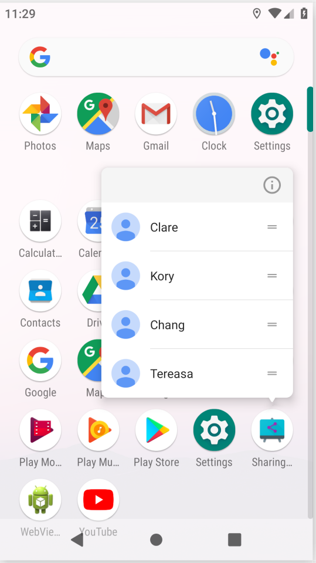

### Bubble  
#### 简介
&emsp;&emsp;气泡是 Android Q 中的一项新功能。借助气泡，用户可以轻松地在设备上的任何位置进行多任务处理。气泡内置于“通知”系统中。它们会浮动在其他应用内容上层，并会跟随用户转到任意位置。气泡可以展开以显示应用功能和信息，并可在不使用时折叠起来。  
&emsp;&emsp;当设备处于已锁定状态或“显示屏始终保持开启状态”处于活动状态时，气泡就会像往常的通知那样显示。  
&emsp;&emsp;气泡是一种可以选择停用的功能。在应用显示其第一个气泡时，系统会显示一个权限对话框，其中提供两个选项：
- 屏蔽来自您的应用的所有气泡 - 通知不会被屏蔽，但永远不会显示为气泡
- 允许来自您的应用的所有气泡 - 通过 BubbleMetaData 发送的所有通知都会显示为气泡    

#### 使用方法  
&emsp;&emsp;Bubble是通过NBotification API创建的，如果想要让通知显示bubble，需要添加一些配置。bubble的展开视图，实际上是一个Activity，但是buuble是一个大小可变，嵌入式的界面，所以这个activity必须具备这样的要求，才能显示为气泡。
```xml
<activity android:name=".BubbleSampleActivity"
    android:theme="@style/Theme.AppCompat.Light.NoActionBar"
    android:label="Bubble Sample"
    android:allowEmbedded="true"
    android:documentLaunchMode="always"
    android:resizeableActivity="true"></activity>
```     
&emsp;&emsp;如果应用显示多个相同类型的气泡，例如与不同联系人的多个聊天对话，则此 Activity 必须能够启动多个实例，那么就要将documentLaunchMode设为“always”。   
&emsp;&emsp;发送一个气泡的基本过程是这样的：
- 创建notification，该则么创建怎么创建。
- 创建一个BubbleMetadata对象。
- 通过Builder的setBubbleMetadata方法把上面的BubbleMetadata对象添加进去。   

示例代码：    
```java
public void onClickGetBubble(View view) {
        Intent target = new Intent(this, BubbleSampleActivity.class);
        PendingIntent bubbleIntent =
                PendingIntent.getActivity(this, 0, target, 0);

        Notification.BubbleMetadata bubbleData =
                new Notification.BubbleMetadata.Builder()
                        .setDesiredHeight(600)
                        .setIcon(Icon.createWithResource(this, R.mipmap.ic_launcher_round))
                        .setIntent(bubbleIntent)
                        .build();

        Notification.Builder builder =
                new Notification.Builder(this, "10010")
                        .setContentIntent(bubbleIntent)
                        .setSmallIcon(R.mipmap.ic_launcher)
                        .setBubbleMetadata(bubbleData);

        NotificationManager mNotificationManager = (NotificationManager) getSystemService(NOTIFICATION_SERVICE);
        NotificationChannel mChannel = new NotificationChannel("10010", "Bubble test", NotificationManager.IMPORTANCE_HIGH);
        mNotificationManager.createNotificationChannel(mChannel);
        mNotificationManager.notify(10010, builder.build());
    }
```    

> &emsp;&emsp;**(官方)注意**：当您第一次发送通知以显示气泡时，此通知必须在具有 IMPORTANCE_HIGH 的通知渠道中。这是因为气泡是由通知重要程度管理器进行处理的。如果系统在用户有机会允许或屏蔽气泡之前便降低了通知的重要程度，则通知便无法显示为气泡。  
> &emsp;&emsp;如果您的应用在发送气泡时位于前台，则系统会忽略重要程度，并始终会显示相应气泡（除非用户已屏蔽来自您应用中的气泡或通知）   

&emsp;&emsp;也可以通过setAutoExpandBubble和setSuppressInitialNotification创建一个直接展开的Bubble，但是在目前版本的android Q中还没有任何效果(没有尝试，官方文档是这样写的)。  
&emsp;&emsp;如果展开气泡，内容 Activity 会完成常规进程生命周期，这会使应用成为前台进程（如果应用尚未在前台运行）。  
&emsp;&emsp;如果折叠或关闭气泡，系统会销毁此 Activity。这可能导致系统缓存此进程，然后将其终止，具体取决于应用是否有正在运行的任何其他前台组件。  
&emsp;&emsp;为了减少对用户造成干扰的次数，气泡仅会在满足以下一个或多个条件时显示：
- 通知使用 MessagingStyle，并添加了 Person。
- 通知来自对 Service.startForeground 的调用，类别为CATEGORY_CALL，并添加了 Person。
- 发送通知时，应用在前台运行。     

&emsp;&emsp;如果上述条件均不满足，则仅显示通知。   

&emsp;&emsp;下面是一些demo中的截图。  

<div align=center></div>  
<div align=center></div>  
<div align=center></div>  

#### 最佳做法    
- bubble会占用屏幕空间并遮盖其他应用内容。仅当非常需要显示bubble（例如进行中的通信）或用户明确要求为某些内容显示bubble时，才将通知发送为bubble。
- 用户可以停用bubble。在这种情况下，bubble通知会显示为一般通知。所以要确保bubble通知也可以作为一般通知使用。
- 从bubble启动的进程（例如 Activity 和对话框）会显示在bubble容器中。这意味着bubble可以有任务堆栈。如果bubble中有很多功能或导航，情况就会变得很复杂。我们建议尽量让bubble功能保持具体且不复杂。  

---------------------  

### Sharing Improving

#### Sharing Shortcuts API  
&emsp;&emsp;Android Q的ShareSheet中的Direct Share API 替换为新的 Sharing Shortcuts API。现有的“直接共享”机制将继续有效，但优先级低于所有使用新版 API 的应用。   
&emsp;&emsp;Sharing Shortcuts API 允许应用提前发布直接共享目标，而不是**被动地按需检索结果**。这就是 ShortcutManager 的工作原理。由于这两个 API 类似，因此我们扩展了 ShortcutInfo API 以让这两个功能更易于使用。借助新版 API，可以直接将类别或人员分配到共享目标。在同一应用更新共享目标或此应用被卸载之前，这些共享目标会一直保留在系统中。    
<div align=center></div>    

&emsp;&emsp;目前，仅支持使用 Sharing Shortcuts API 发布直接共享目标。要使用该新版 API 发布直接共享目标，请按以下步骤操作：
- 在应用的 XML 资源文件中声明 share-target 元素。
- 将动态快捷方式连同匹配的类别一起发布到声明的 share-target。可以使用 AndroidX 中的 ShortcutManager 或 ShortcutManagerCompat 来添加、访问、更新和移除快捷方式。使用 AndroidX 中的兼容性内容库是首选方式，因为它可以向后兼容更早的 Android 版本。   

&emsp;&emsp;共享目标必须在应用的资源文件中声明，类似于静态快捷方式定义。将共享目标定义连同其他静态快捷方式定义一起添加到资源文件中的 <shortcuts> 根元素中。每个 <share-target> 元素都包含与共享数据类型、匹配类别以及将处理共享 Intent 的目标类有关的信息。

 res/xml/shorcuts.xml
 ```XML
<shortcuts xmlns:android="http://schemas.android.com/apk/res/android">
    <share-target android:targetClass="com.example.android.sharingshortcuts.SendMessageActivity">
        <data android:mimeType="text/plain" />
        <category android:name="com.example.android.sharingshortcuts.category.TEXT_SHARE_TARGET" />
    </share-target>
</shortcuts>
```    

&emsp;&emsp;共享目标中的数据元素类似于 Intent 过滤器中的数据规范。每个共享目标都可以有多个类别，这些类别仅用于将应用的已发布快捷方式匹配到相应的共享目标定义。类别可以具有应用定义的任意值(这个值是我们自己定义的)。  
&emsp;&emsp;如果用户在 ShareSheet 中选择与上述 share-target 示例相匹配的直接共享目标（快捷方式），则应用将获得以下共享 Intent：     
```java
Action: Intent.ACTION_SEND
ComponentName: {com.example.android.sharingshortcuts /
                com.example.android.sharingshortcuts.SendMessageActivity}
Data: Uri to the shared content
EXTRA_SHORTCUT_ID: <ID of the selected shortcut>

```   
&emsp;&emsp;如果用户从启动器快捷方式打开共享目标，则应用将获得在将共享快捷方式添加到 ShortcutManagerCompat 时创建的 intent。    

<div align=center></div>     

```java
// 启动器快捷方式打开共享目标，将会传入这个intent
Intent staticLauncherShortcutIntent = new Intent(Intent.ACTION_DEFAULT);

// Creates a new Sharing Shortcut and adds it to the list
// The id passed in the constructor will become EXTRA_SHORTCUT_ID in the received Intent
shortcuts.add(new ShortcutInfoCompat.Builder(context, Integer.toString(id))
        .setShortLabel(contact.getName())
        // Icon that will be displayed in the share target
        .setIcon(IconCompat.createWithResource(context, contact.getIcon()))
        .setIntent(staticLauncherShortcutIntent)
        // Make this sharing shortcut cached by the system
        // Even if it is unpublished, it can still appear on the sharesheet
        .setLongLived()
        .setCategories(contactCategories)
        // Person objects are used to give better suggestions
        .setPerson(new Person.Builder()
                .setName(contact.getName())
                .build())
        .build());
```

#### AndroidX中新的组件  
&emsp;&emsp;ShortcutManagerCompat 是一个新版 AndroidX API，它可以向后兼容旧版 DirectShare API。这是发布共享目标的首选方式。
&emsp;&emsp;为了能够使用兼容性内容库，应用清单必须包含元数据 chooser-target-service 和 intent-filter 集。
&emsp;&emsp;此service已在兼容性内容库中声明，因此用户无需在应用清单中声明此服务。但是，必须将从共享 Activity 到服务的链接视为选择器目标提供程序。
&emsp;&emsp;在以下示例中，ChooserTargetService 的实现为 androidx.core.content.pm.ChooserTargetServiceCompat，已在 AndroidX 中定义：   

```java
<activity
            android:name=".SendMessageActivity"
            android:label="@string/app_name"
            android:theme="@style/SharingShortcutsDialogTheme">

            <intent-filter>
                <action android:name="android.intent.action.SEND" />
                <category android:name="android.intent.category.DEFAULT" />
                <data android:mimeType="text/plain" />
            </intent-filter>

            <!-- 只有在引入了AndroidX 分享库的时候，这里的设置才是必要的 -->
            <!-- activity需要通过这个chooser service来获得分享intent -->
            <meta-data
                android:name="android.service.chooser.chooser_target_service"
                android:value="androidx.sharetarget.ChooserTargetServiceCompat" />
        </activity>
```   

#### 一些疑问   
***新版 API 和旧版 DirectShare API 之间的主要区别是什么？***
> 新版 API 采用的是推模式，而旧版 DirectShare API 采用的是拉模式。在准备 ShareSheet 时，使用新版 API 检索直接共享目标的过程要比使用旧版 API 快得多。从应用开发者的角度来看，在使用新版 API 时，应用需要提前提供直接共享目标列表，并且每当应用的内部状态发生变化（例如，如果在短信应用中添加了新联系人）时都可能需要更新快捷方式列表。

***如果我不迁移到使用新版 API，会出现什么情况？***
> 在 Android Q 及更高版本上，ShareSheet 将为通过 ShortcutManager（新版 API）提供的共享目标提供更高的优先级。因此，您发布的共享目标可能会被其他应用的共享目标淹没，并且可能永远不会在进行共享时显示。

***我可以在我的应用中同时使用旧版和新版 DirectShare API 以实现向后兼容吗？***
>请不要这样做！相反，请使用所提供的支持库 API (ShortcutManagerCompat)。混用这两组 API 可能会导致在检索共享目标时出现不必要/意外的行为。

***共享目标的已发布快捷方式与启动器快捷方式（长按启动器中的应用图标时通常使用这些快捷方式）有何不同？***
> 为“共享目标”而发布的任何快捷方式同时也是一种启动器快捷方式，并且在长按您的应用图标时会显示在菜单中。每个 Activity 的快捷方式计数上限也适用于应用要发布的快捷方式的总数（共享目标和旧版启动器快捷方式数之和）。    

-----------------------------------------

### Add Serverless Functionality to Android Apps with Firebase   

#### 基本介绍

> 在youtube上可以找到google几年前的serverless functionality视频，只不过那时候不叫Firebase，叫Google cloud。  

&emsp;&emsp;Serverless Functionality(Firebase)致力于让开发者更多的关注前端代码，而不用去考虑后台架构和管理，包不用配置管理和维护物理服务器和虚拟机，不用担心身份验证，授权，业务逻辑，滥用，架构验证，操作系统
，语言环境，安全性，补丁以及物理机器上的配额。在这种理想状态下，开发只需要专注于前端代码，相当于将服务器业务外包，而不用去考虑服务器的容量缩放，安全性等种种问题。   

&emsp;&emsp;Firebase解决了三个核心问题：
- 提供核心无服务器构建块，免于管理服务器和扩展。(Remote config)
- 监控诊断工具，帮助用户快速构建一个稳定的应用程序。(?)
- 了解用户，帮助使用者构建一个更好的应用。(Analytics)     

&emsp;&emsp;视频中提到了一些比较不错的特性。举个例子，上传照片，再上传过程中，出现短暂的离线，比如地铁信号差，进了隧道什么的，这时候上传进程会暂停，但是在网路条件恢复的时候firebase会自动帮助app“优雅地”续传；但是如果在断网过程中，app进程被杀死了或者进入了一个相对较长的断网比如飞行模式，就需要开发者自己来做处理。在这里还特别提到了一个jetpack中的新组件，配合这个组件在后台来完成续传或者一些保存业务，即便是app已经被杀死，这个组件是什么？   

> WorkManager可以保证在app被杀死的情况下依然进行业务操作，并且不会阻塞主线程。      


---------------------------------

### Build Testable App    

&emsp;&emsp;随着一个app从无到有，从小到大，一次次迭代下来，风格的变化，业务的日益丰富，以及我们不断扩大的需求远景，app的体量也会变的越来越大。而为了满足这些需求，我们也需要创新，从架构、工具、模式和方法上需求突破。   
&emsp;&emsp;我们该如何架构我们的app？应该使用哪些工具，哪些库？我们在app开发最初做的选择将会对app的可测试性产生深远的影响。这又会影响到app是否可以以可持续的方式添加新的功能，是否可以更简捷的维护，甚至我们个人的发展速度和能力。   
&emsp;&emsp;在测试中，有三个需要考虑的重要属性：  
- Scope(范围)：在我的程序中，要覆盖多少业务，可以跨越多少个功能或者多少个屏幕。
- Spped(速度)：我的测试代码可以执行的多快，毫秒级或者其他
- Fidelity(忠诚度)：代表测试用例与真实场景又多接近。

&emsp;&emsp;测试范围的增加，会使测试忠诚度提高，但是会牺牲测试速度，反之亦然。事实上，我们没有办法进行一场完美的测试，可以满足各个方面的要求。关键在，我们如何找到一个足够好的平衡点。   

&emsp;&emsp;下面是一张比较完美的测试金字塔：
<div align=center></div>     

- Unit tests:单元测试，这一部分必须快速，轻便，高度专注集中，以保证可以实现高可扩展性。单元测试用例很好定义，在一般意义上，一个单元测试用例就代表一个类的单个方法。   
- Integration tests:集成测试，在这里我们要将几个单元测试整合到一起，完成对一个具体的完整的流程的测试。我们要通过验证各个单元测试用例的合作，来保证整个流程带到我们的预期。    
- E2E tests:端到端测试，在这里我们进入了一个关键点，在这个阶段，我们测试的是整个应用。     

&emsp;&emsp;在每个项目开始的时候，如果不注重设计架构，组织代码结构，那么在代码库就会朝着不可控的方向发展，慢慢变得失控。如果一个项目不遵循这样的原则，那么他的内部必定杂乱不堪，各个部分将会难以被分开进行单独的测试，那么就意味着，在任何时候在任何地方做一个很小的改动，都会导致其他存在依赖的部分发生变化，就要去重建相关内容。那么到最后，这样的项目往往变现出了一个和上面测试金字塔完全相反的态势，最终成为一个大型甚至超大型的端到端测试。   

&emsp;&emsp;这时候我们的第一想法，就是分层架构。对应android中的概念，我们削减依赖关系，遵循高内聚低耦合的原则，依赖注入等，可以产生出这样的一张映射图：  
<div align=center></div>    

&emsp;&emsp;在这种结构中，各个模块干净独立，使单元测试成为可能。但是，随着项目的进行，发现这个结构会随着需求和功能的增长而变得越来越复杂，而不是架构层级(因为只有三级)，所以，在最终场景下，使用这种方式模块化我们的代码，业务栈中的一个小的变化，和过去相比只会较少几层模块的重构，但是遇到下沉度更高的改变，仍然会导致大部分甚至整个模块的重构。所以到最后，这又会变成一个大型的端到端测试，只不过比原来好了一些。现在我们可以进行单元测试了，但是呈现一种这样的金字塔结构。   

<div align=center></div>       

&emsp;&emsp;这样做的问题是，为了弥补单元测试和集成测试的差距，我们过度补偿在了端到端测试中，并且但目前为止，没有一个完备的方案能给我们提供一个平衡的金字塔。我们很快就会发现，在糟糕的组织架构的代码下，我们的开发很快就会出现瓶颈，不管是需求扩展还是项目质量，都变得不尽人意。     
&emsp;&emsp;而在这种大型的端到端测试中，我们的测试速度会变得越来越慢，出现的问题变得越来越难以追查。没有有效的模块划分和下沉，我们对项目做的每一项更改，都有可能导致大量的不正确的变化，最终大致大量模块的重构。而这些产生的所有问题，豆都将拖慢开发速度和测试速度。    
&emsp;&emsp;但正确的组织代码，对可测试性和开发速度会产生很大的影响。所以从一开始我们就希望选择正确的方式，保证项目的可扩展性，可维护性和可测试性。     
&emsp;&emsp;为了创造一个满足上数特性的项目，可以使用jetpack的组件：
- Databinding
- ViewModel
- LiveData  
- Navigation
- Room    

&emsp;&emsp;首先，我们可以从一个单一的Activity开始，使用Navigation，来管理界面流(one app，one activity)。通过不同的Fragment，来实现不同的界面。然后每个Framgent都有自己的布局xml，每个xml又可以使用DataBinding组件映射到对应的VIewModel。然后可以使用LiveData来讲数据的变化实时反映到视图中。最后，使用Room抽象画我们的本地存储数据层。   
&emsp;&emsp;并且，应该以测试驱动开发的思想来开发我们的项目。  
<div align=center></div>     

&emsp;&emsp;我们应该先编写测试用例，把测试用例作为写代码的指导规范，然后在开始写代码，确定符合测试用例。并且，我们也要自上而下的进行这一步骤，从端到端测试开始写起，然后层层深入到各个单一的模块，左后完成这个项目的规范设计。   
&emsp;&emsp;首先是端到端测试，这一部分实际上就是UI自动化测试，在这里我们要进行和UI相关的互动性测试，使用Espresso在真机或者虚拟机上进行，或者使用Robolectric来模拟android环境。在这一部分，基本按照这样的顺序进行：找到需要测试的view，模拟某种操作，验证操作的结果是否正确。   

<div align=center></div>

&emsp;&emsp;然后是集成测试，在这里我们不会太过于依赖真实的组件，并且可以使用测试API。但是在这一层级下我们应该进行测试？再上一层级中，是一个更大范围的测试，可能是跨view，也可能是跨界面，但是在集成测试中，会进行细化，比如，只测试一个界面的场景。在这一层中，包含很少甚至不会包含UI相关的测试，可以使用JUnit、Mockito、Robolectric等工具进行测试用例的编写。     

<div align=center></div>    

&emsp;&emsp;最后是单元测试，单元测试针对更小的单元，一个具体的方法。这类的测试范围要尽可能的小，以确保测试速度和忠诚度。在这里我们想要的是测试行为和结果，而不是实现。   

<div align=center></div>    
