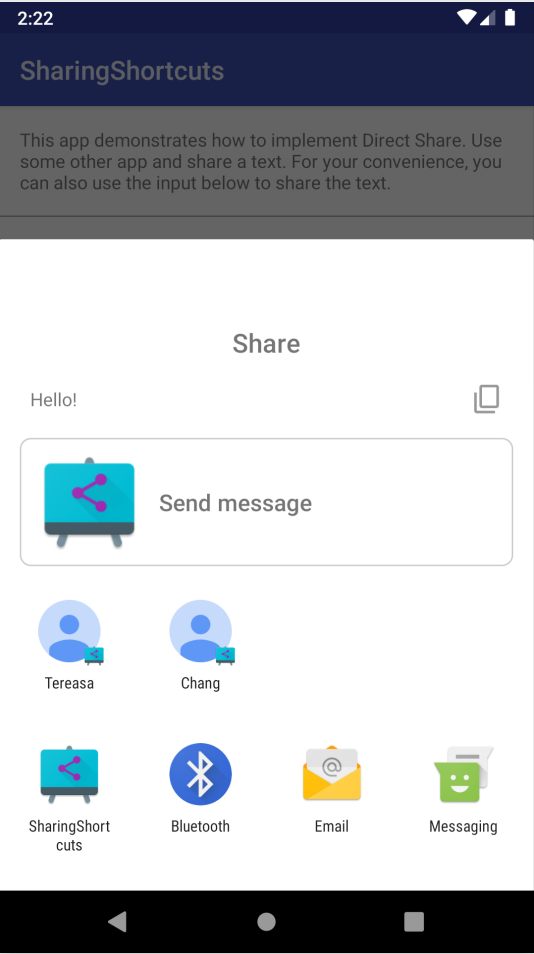
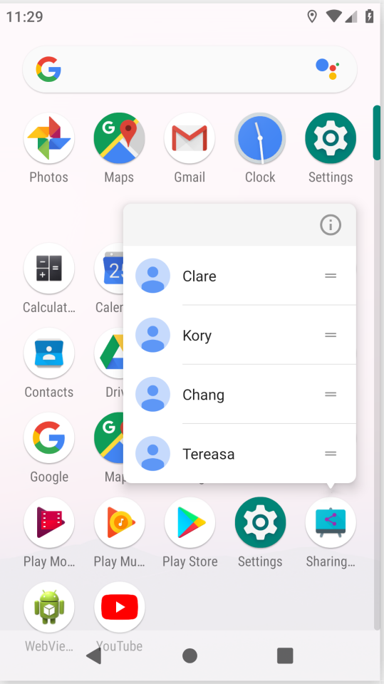

### Sharing Improving


| | 一个普通标题 | 一个普通标题 |
| ------ | ------ | ------ |
| 不同点 | 中等文本 | 稍微长一点的文本 |
| 稍微长一点的文本 | 短文本 | 中等文本 |

#### Sharing Shortcuts API  
&emsp;&emsp;Android Q的ShareSheet中的Direct Share API 替换为新的 Sharing Shortcuts API。现有的“直接共享”机制将继续有效，但优先级低于所有使用新版 API 的应用。   
&emsp;&emsp;Sharing Shortcuts API 允许应用提前发布直接共享目标，而不是**被动地按需检索结果**。这就是 ShortcutManager 的工作原理。由于这两个 API 类似，因此我们扩展了 ShortcutInfo API 以让这两个功能更易于使用。借助新版 API，可以直接将类别或人员分配到共享目标。在同一应用更新共享目标或此应用被卸载之前，这些共享目标会一直保留在系统中。    
<div align=center></div>    

&emsp;&emsp;目前，仅支持使用 Sharing Shortcuts API 发布直接共享目标。要使用该新版 API 发布直接共享目标，请按以下步骤操作：
- 在应用的 XML 资源文件中声明 share-target 元素。
- 将动态快捷方式连同匹配的类别一起发布到声明的 share-target。可以使用 AndroidX 中的 ShortcutManager 或 ShortcutManagerCompat 来添加、访问、更新和移除快捷方式。使用 AndroidX 中的兼容性内容库是首选方式，因为它可以向后兼容更早的 Android 版本。   

&emsp;&emsp;共享目标必须在应用的资源文件中声明，类似于静态快捷方式定义。将共享目标定义连同其他静态快捷方式定义一起添加到资源文件中的 <shortcuts> 根元素中。每个 <share-target> 元素都包含与共享数据类型、匹配类别以及将处理共享 Intent 的目标类有关的信息。

 res/xml/shorcuts.xml
 ```XML
<shortcuts xmlns:android="http://schemas.android.com/apk/res/android">
    <share-target android:targetClass="com.example.android.sharingshortcuts.SendMessageActivity">
        <data android:mimeType="text/plain" />
        <category android:name="com.example.android.sharingshortcuts.category.TEXT_SHARE_TARGET" />
    </share-target>
</shortcuts>
```    

&emsp;&emsp;共享目标中的数据元素类似于 Intent 过滤器中的数据规范。每个共享目标都可以有多个类别，这些类别仅用于将应用的已发布快捷方式匹配到相应的共享目标定义。类别可以具有应用定义的任意值(这个值是我们自己定义的)。  
&emsp;&emsp;如果用户在 ShareSheet 中选择与上述 share-target 示例相匹配的直接共享目标（快捷方式），则应用将获得以下共享 Intent：     
```java
Action: Intent.ACTION_SEND
ComponentName: {com.example.android.sharingshortcuts /
                com.example.android.sharingshortcuts.SendMessageActivity}
Data: Uri to the shared content
EXTRA_SHORTCUT_ID: <ID of the selected shortcut>

```   
&emsp;&emsp;如果用户从启动器快捷方式打开共享目标，则应用将获得在将共享快捷方式添加到 ShortcutManagerCompat 时创建的 intent。  
<div align=center></div>   
```java
// 启动器快捷方式打开共享目标，将会传入这个intent
Intent staticLauncherShortcutIntent = new Intent(Intent.ACTION_DEFAULT);

// Creates a new Sharing Shortcut and adds it to the list
// The id passed in the constructor will become EXTRA_SHORTCUT_ID in the received Intent
shortcuts.add(new ShortcutInfoCompat.Builder(context, Integer.toString(id))
        .setShortLabel(contact.getName())
        // Icon that will be displayed in the share target
        .setIcon(IconCompat.createWithResource(context, contact.getIcon()))
        .setIntent(staticLauncherShortcutIntent)
        // Make this sharing shortcut cached by the system
        // Even if it is unpublished, it can still appear on the sharesheet
        .setLongLived()
        .setCategories(contactCategories)
        // Person objects are used to give better suggestions
        .setPerson(new Person.Builder()
                .setName(contact.getName())
                .build())
        .build());
```

#### AndroidX中新的组件  
&emsp;&emsp;ShortcutManagerCompat 是一个新版 AndroidX API，它可以向后兼容旧版 DirectShare API。这是发布共享目标的首选方式。
&emsp;&emsp;为了能够使用兼容性内容库，应用清单必须包含元数据 chooser-target-service 和 intent-filter 集。
&emsp;&emsp;此service已在兼容性内容库中声明，因此用户无需在应用清单中声明此服务。但是，必须将从共享 Activity 到服务的链接视为选择器目标提供程序。
&emsp;&emsp;在以下示例中，ChooserTargetService 的实现为 androidx.core.content.pm.ChooserTargetServiceCompat，已在 AndroidX 中定义：   
```java
<activity
            android:name=".SendMessageActivity"
            android:label="@string/app_name"
            android:theme="@style/SharingShortcutsDialogTheme">

            <intent-filter>
                <action android:name="android.intent.action.SEND" />
                <category android:name="android.intent.category.DEFAULT" />
                <data android:mimeType="text/plain" />
            </intent-filter>

            <!-- 只有在引入了AndroidX 分享库的时候，这里的设置才是必要的 -->
            <!-- activity需要通过这个chooser service来获得分享intent -->
            <meta-data
                android:name="android.service.chooser.chooser_target_service"
                android:value="androidx.sharetarget.ChooserTargetServiceCompat" />
        </activity>
```   

#### 一些疑问   
***新版 API 和旧版 DirectShare API 之间的主要区别是什么？***
> 新版 API 采用的是推模式，而旧版 DirectShare API 采用的是拉模式。在准备 ShareSheet 时，使用新版 API 检索直接共享目标的过程要比使用旧版 API 快得多。从应用开发者的角度来看，在使用新版 API 时，应用需要提前提供直接共享目标列表，并且每当应用的内部状态发生变化（例如，如果在短信应用中添加了新联系人）时都可能需要更新快捷方式列表。

***如果我不迁移到使用新版 API，会出现什么情况？***
> 在 Android Q 及更高版本上，ShareSheet 将为通过 ShortcutManager（新版 API）提供的共享目标提供更高的优先级。因此，您发布的共享目标可能会被其他应用的共享目标淹没，并且可能永远不会在进行共享时显示。

***我可以在我的应用中同时使用旧版和新版 DirectShare API 以实现向后兼容吗？***
>请不要这样做！相反，请使用所提供的支持库 API (ShortcutManagerCompat)。混用这两组 API 可能会导致在检索共享目标时出现不必要/意外的行为。

***共享目标的已发布快捷方式与启动器快捷方式（长按启动器中的应用图标时通常使用这些快捷方式）有何不同？***
> 为“共享目标”而发布的任何快捷方式同时也是一种启动器快捷方式，并且在长按您的应用图标时会显示在菜单中。每个 Activity 的快捷方式计数上限也适用于应用要发布的快捷方式的总数（共享目标和旧版启动器快捷方式数之和）。
