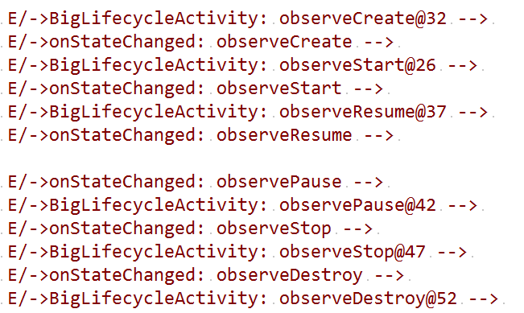
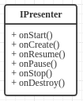
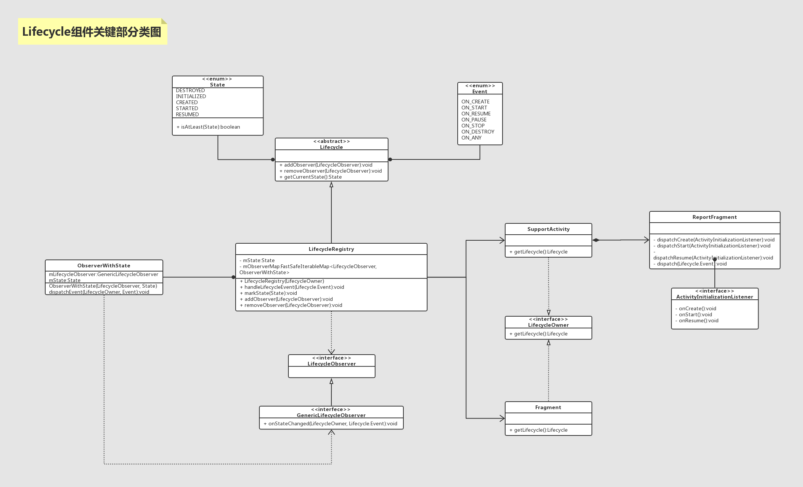

# Jetpack

------------------

## 一 Lifecycle    

> 基于android.arch.lifecycle:extensions:1.1.1，该版本包含Lifecycle+LiveData+ViewModel。并没有根据AndroidX包中的API进行分析，因为家中翻墙实在难受。

> Lifecycle-aware components perform actions in response to a change in the lifecycle status of another component, such as activities and fragments. These components help you produce better-organized, and often lighter-weight code, that is easier to maintain.(Lifecycle可以检测Activity或者Fragment的生命周期变化，用来构建更轻量级的代码)
>
> A common pattern is to implement the actions of the dependent components in the lifecycle methods of activities and fragments. However, this pattern leads to a poor organization of the code and to the proliferation of errors. By using lifecycle-aware components, you can move the code of dependent components out of the lifecycle methods and into the components themselves.(当某个组件需要依赖Activity或者Fragment的生命周期的时候，我们通常的做法是在生命周期中实现我们的业务。但是这样会降低代码的组织结构并且引起大量的错误。通过使用Lifecycle组件，我们可以把具体的业务逻辑从Activity或者Fragment的生命周期里转移到各自的组件中)   

### 1.1 一般使用方法    

&emsp;&emsp;Lifecycle是感知组件生命周期的架构组件，所以他的使用离不开Activity或者Fragment的生命周期方法。

- BigLifecycleActivity.java  
```java
    // 直接使用LifecycleOberver接口，但是内部要使用对应生命周期的注解来绑定对应的方法。
    private void observeLifecycle() {
        getLifecycle().addObserver(new LifecycleObserver() {

            @OnLifecycleEvent(Lifecycle.Event.ON_START)
            void observeStart(){
                Log.e("->BigLifecycleActivity", "observeStart@26 --> " + "");
            }

            @OnLifecycleEvent(Lifecycle.Event.ON_CREATE)
            void observeCreate(){
                Log.e("->BigLifecycleActivity", "observeCreate@32 --> " + "");
            }

            @OnLifecycleEvent(Lifecycle.Event.ON_RESUME)
            void observeResume(){
                Log.e("->BigLifecycleActivity", "observeResume@37 --> " + "");
            }

            @OnLifecycleEvent(Lifecycle.Event.ON_PAUSE)
            void observePause(){
                Log.e("->BigLifecycleActivity", "observePause@42 --> " + "");
            }

            @OnLifecycleEvent(Lifecycle.Event.ON_STOP)
            void observeStop(){
                Log.e("->BigLifecycleActivity", "observeStop@47 --> " + "");
            }

            @OnLifecycleEvent(Lifecycle.Event.ON_DESTROY)
            void observeDestroy(){
                Log.e("->BigLifecycleActivity", "observeDestroy@52 --> " + "");
            }
        });
    }
```  
```java
// 使用API中自带的GenericLifecycleObserver，实现方法中的onStateChanged、但是这个类有作用域限制，不一定好使。
    private void observeLifecycleByGeneric() {
        getLifecycle().addObserver(new GenericLifecycleObserver() {
            @Override
            public void onStateChanged(LifecycleOwner source, Lifecycle.Event event) {
                switch (event) {
                    case ON_START:{
                        Log.e("->onStateChanged", "observeStart --> " + "");
                    }break;
                    case ON_CREATE:{
                        Log.e("->onStateChanged", "observeCreate --> " + "");
                    }break;
                    case ON_RESUME:{
                        Log.e("->onStateChanged", "observeResume --> " + "");
                    }break;
                    case ON_PAUSE:{
                        Log.e("->onStateChanged", "observePause --> " + "");
                    }break;
                    case ON_STOP:{
                        Log.e("->onStateChanged", "observeStop --> " + "");
                    }break;
                    case ON_DESTROY:{
                        Log.e("->onStateChanged", "observeDestroy --> " + "");
                    }break;
                    case ON_ANY:{
                        Log.e("->onStateChanged", "observeAny --> " + "");
                    }break;
                }
            }
        });
    }
```

&emsp;&emsp;这是两种比较基本的使用方法，这样调用之后就可以绑定所在组件的生命周期。下面是例子中的日志截图：

<div align=center></div></br>    

&emsp;&emsp;但是，有没有人在这里会有疑问？**上面的写法以及达到的效果貌似并没有什么用，感觉像是在炫技，反而为了使用组件的生命周期多加了一层回调，何必呢？**   

&emsp;&emsp;就像我在开头说的一样，**当某个组件需要依赖Activity或者Fragment的生命周期的时候，我们通常的做法是在生命周期中实现我们的业务。但是这样会降低代码的组织结构并且引起大量的错误。通过使用Lifecycle组件，我们可以把具体的业务逻辑从Activity或者Fragment的生命周期里转移到各自的代码逻辑中，保持代码的整洁和健壮。**   

&emsp;&emsp;假如有一个使用MVP构建的项目，我需要一个Presenter，但是这个Presenter必须能够监听到FragmentActivity或者Fragment的生命周期，并根据不同的周期作出不同的逻辑操作。那么再不使用Lifecycles组件的情况下如何处理？   
&emsp;&emsp;我们可能会这样写：先定义一个IPresenter，包含全部与FragmentActivity生命周期函数相对应的方法，类图是这样的   

<div align=center></div>     

&emsp;&emsp;然后再代码中是这样写的：  
- BigLifecycleActivity.Java
```java
    // ...
    @Override
    protected void onStart() {
        super.onStart();
        mOldPresenter.onStart();
    }

    @Override
    protected void onResume() {
        super.onResume();
        mOldPresenter.onResume();
    }

    @Override
    protected void onPause() {
        super.onPause();
        mOldPresenter.onPause();
    }
    // ...
```     

&emsp;&emsp;那么可想而知，我们的Presenter将会拥有一个松散的结构，暴露了太多的细节在生命周期中，无论在写代码的效率上还是日后的维护上，都将处于一种很被动的状态。并且很容易出错，出了错定位问题的成本也很高。但是如果我们这样去写Presenter呢？   

- PresenterImpl.java
```java
public class PresenterImpl implements GenericLifecycleObserver, IPresenter {
    @Override
    public void onStateChanged(LifecycleOwner source, Lifecycle.Event event) {
        switch (event){
            case ON_START:{
                // do something when START
            }break;
            case ON_CREATE:{
                // do something when CREATE
            }break;
            case ON_RESUME:{
                // do something when RESUME
            }break;
            case ON_PAUSE:{
                // do something when PAUSE
            }break;
            case ON_STOP:{
                // do something when STOP
            }break;
            case ON_DESTROY:{
                // do something when DESTROY
            }break;
        }
    }
}
```    
&emsp;&emsp;我们只需要在activity或者Fragment中添加一行代码，就能将生命周期完整的封装进Presenter中。  

- BigLifecycleActivity.Java
```java
private PresenterImpl mPresenter;
// 这行代码会将生命周期赋予Presenter，相当于Presenter也产生了和Activity或者Fragment一样的生命周期。
getLifecycle().addObserver(mPresenter);  
```   

&emsp;&emsp;那么问题来了，**生命周期是如何流入Presenter的？内部的原理是什么样的？**   

### 1.2 被"赋予"生命周期的原理   

&emsp;&emsp;在这里我们可以大胆的猜测一下，Lifecycle感应生命周期的基础是什么？Activity和Fragment都有生命周期，是怎么通过Lifecycle传递到Presenter中的呢？也许在源码的最后还是在Activity或者Fragment的生命周期函数中埋下了分发方法，就像上面BigLifecycleActivity.Java的代码一样。

&emsp;&emsp;解答这个问题，最好的方式是按照使用方法，层层深入，在源码中找答案。在这里，我们以Activity的监听过程为例，以Fragment为主的那一部分打架感兴趣的自行查看源代码，原理上大同小异。    

&emsp;&emsp;首先我们查看使用代码的第一个方法---getLifecycle()   
- LifecycleOwner.Java
```Java
public interface LifecycleOwner {
    /**
     * Returns the Lifecycle of the provider.
     *
     * @return The lifecycle of the provider.
     */
    @NonNull
    Lifecycle getLifecycle();
}
```   
- SupportActivity.Java
```Java
public class SupportActivity extends Activity implements LifecycleOwner {
    ...
    private LifecycleRegistry mLifecycleRegistry = new LifecycleRegistry(this);

    @Override
    @SuppressWarnings("RestrictedApi")
    protected void onCreate(@Nullable Bundle savedInstanceState) {
        super.onCreate(savedInstanceState);
        // 这里是关键，下面会讲到，不可遗忘
        ReportFragment.injectIfNeededIn(this);
    }

    ...

    @Override
    public Lifecycle getLifecycle() {
        return mLifecycleRegistry;
    }

    ...
}
```   
- LifecycleRegistry.java
```Java
public class LifecycleRegistry extends Lifecycle {
  ...
}
```   

&emsp;&emsp;最终我们在层层深入查看代码的时候发现了这样的关系：SupportActivity实现了一个接口LifecycleOwner，并实现了这个接口的方法getLifecycle。最后这个方法的返回值是一个LifecycleRegistry对象，而LifecycleRegistry实现了Lifecycle接口。那么关于getLifecycle方法的分析就到这里，下面是这个方法返回的Lifecycle对象的addObserver方法。从上面的代码中我们可以知道，返回的Lifecycle实际上是一个LifecycleRegistry对象，那么我们就要深入LifecycleRegistry的源码看一下addObserver的运作基本原理。   
- LifecycleRegistry.java
```Java
public class LifecycleRegistry extends Lifecycle {
    /**
     * Custom list that keeps observers and can handle removals / additions during traversal.
     *
     * Invariant: at any moment of time for observer1 & observer2:
     * if addition_order(observer1) < addition_order(observer2), then
     * state(observer1) >= state(observer2),
     */
    private FastSafeIterableMap<LifecycleObserver, ObserverWithState> mObserverMap =
            new FastSafeIterableMap<>();

    private final WeakReference<LifecycleOwner> mLifecycleOwner;

    /**
     * Creates a new LifecycleRegistry for the given provider.
     * <p>
     * You should usually create this inside your LifecycleOwner class's constructor and hold
     * onto the same instance.
     *
     * @param provider The owner LifecycleOwner
     */
    public LifecycleRegistry(@NonNull LifecycleOwner provider) {
        mLifecycleOwner = new WeakReference<>(provider);
        mState = INITIALIZED;
    }

    @Override
    public void addObserver(@NonNull LifecycleObserver observer) {
        State initialState = mState == DESTROYED ? DESTROYED : INITIALIZED;
        ObserverWithState statefulObserver = new ObserverWithState(observer, initialState);
        ObserverWithState previous = mObserverMap.putIfAbsent(observer, statefulObserver);

        if (previous != null) {
            return;
        }
        LifecycleOwner lifecycleOwner = mLifecycleOwner.get();
        if (lifecycleOwner == null) {
            // it is null we should be destroyed. Fallback quickly
            return;
        }

        ...
    }
}
```    

&emsp;&emsp;从上面的代码中我们可以看到，添加的oberver被add进一个字典里，保存起来。OK，到这里为止，已经把observer的添加逻辑分析我完毕，这只是简单的分析，其实代码中还有很多写的很"玄妙"的逻辑，一时半会也分析不出来什么。那么接下来就是最主要的部分---生命周期分发逻辑的源码分析。    

&emsp;&emsp;在上面的SupportActivity源码中，我们特殊标注了一个地方，这是一个关键点---ReportFragment。   
> 在Android中，Fragment的灵活运用远远超过我们的想象。在我们的额印象中，Fragment就是一个"布局"一个界面，但是在Android源码中，Fragment表现出来的更多的是一个和生命周期相关的可以用来处理UI的**类**。这也是一种编程思维上的trick，比如这里的ReportFragment，以及之后会讲到的VIewModel中的HolderFragment，都是一种灵活运用的变现。

```Java
public class ReportFragment extends Fragment {
    private static final String REPORT_FRAGMENT_TAG = "android.arch.lifecycle"
            + ".LifecycleDispatcher.report_fragment_tag";

    public static void injectIfNeededIn(Activity activity) {
        // 在Activity创建的时候，注入一个ReportFragment
        android.app.FragmentManager manager = activity.getFragmentManager();
        if (manager.findFragmentByTag(REPORT_FRAGMENT_TAG) == null) {
            manager.beginTransaction().add(new ReportFragment(), REPORT_FRAGMENT_TAG).commit();
            // Hopefully, we are the first to make a transaction.
            manager.executePendingTransactions();
        }
    }

    static ReportFragment get(Activity activity) {
        return (ReportFragment) activity.getFragmentManager().findFragmentByTag(
                REPORT_FRAGMENT_TAG);
    }

    // *************************************************************************
    // 第一部分
    private ActivityInitializationListener mProcessListener;

    private void dispatchCreate(ActivityInitializationListener listener) {
        if (listener != null) {
            listener.onCreate();
        }
    }

    private void dispatchStart(ActivityInitializationListener listener) {
        if (listener != null) {
            listener.onStart();
        }
    }

    private void dispatchResume(ActivityInitializationListener listener) {
        if (listener != null) {
            listener.onResume();
        }
    }
    // *************************************************************************

    // *************************************************************************
    // 第二部分
    @Override
    public void onActivityCreated(Bundle savedInstanceState) {
        super.onActivityCreated(savedInstanceState);
        dispatchCreate(mProcessListener);
        dispatch(Lifecycle.Event.ON_CREATE);
    }

    @Override
    public void onStart() {
        super.onStart();
        dispatchStart(mProcessListener);
        dispatch(Lifecycle.Event.ON_START);
    }

    @Override
    public void onResume() {
        super.onResume();
        dispatchResume(mProcessListener);
        dispatch(Lifecycle.Event.ON_RESUME);
    }

    @Override
    public void onPause() {
        super.onPause();
        dispatch(Lifecycle.Event.ON_PAUSE);
    }

    @Override
    public void onStop() {
        super.onStop();
        dispatch(Lifecycle.Event.ON_STOP);
    }

    @Override
    public void onDestroy() {
        super.onDestroy();
        dispatch(Lifecycle.Event.ON_DESTROY);
        // just want to be sure that we won't leak reference to an activity
        mProcessListener = null;
    }
    // *************************************************************************

    // *************************************************************************
    // 第三部分
    private void dispatch(Lifecycle.Event event) {
        Activity activity = getActivity();

        ...

        if (activity instanceof LifecycleOwner) {
            Lifecycle lifecycle = ((LifecycleOwner) activity).getLifecycle();
            if (lifecycle instanceof LifecycleRegistry) {
                ((LifecycleRegistry) lifecycle).handleLifecycleEvent(event);
            }
        }
    }
    // *************************************************************************

    // *************************************************************************
    // 第四部分
    void setProcessListener(ActivityInitializationListener processListener) {
        mProcessListener = processListener;
    }

    interface ActivityInitializationListener {
        void onCreate();

        void onStart();

        void onResume();
    }
    // *************************************************************************
}
```   

&emsp;&emsp;首先，SupportActivity在create时调用ReportFragment的静态方法injectIfNeededIn主动注入一个ReportFragment的实例。然后，我们来看看其他的代码，以发现一些其他的东西。看第二部分代码，这是则个Fragment的生命周期方法，每个方法中都调用了一个方法dispatch()，然后我们看第三部分代码中的dispatch方法的源码，发现，在生命周期中，调用了LifecycleRegistry的handleLifecycleEvent方法来分发生命周期事件。来看一下LifecycleRegistry的handleLifecycleEven方法。   

```Java
public void handleLifecycleEvent(@NonNull Lifecycle.Event event) {
        ...
        moveToState(next);
    }

    private void moveToState(State next) {
        ...
        sync();
        ...
    }
    
    private void sync() {
        LifecycleOwner lifecycleOwner = mLifecycleOwner.get();
        if (lifecycleOwner == null) {
            Log.w(LOG_TAG, "LifecycleOwner is garbage collected, you shouldn't try dispatch "
                    + "new events from it.");
            return;
        }
        ...
        backwardPass(lifecycleOwner);
        ...
        forwardPass(lifecycleOwner);
        ...
    }
    
    private void forwardPass(LifecycleOwner lifecycleOwner) {
        ...
        ObserverWithState observer = entry.getValue();
        observer.dispatchEvent(lifecycleOwner, upEvent(observer.mState));
        ...
    }
    
    static class ObserverWithState {
        State mState;
        GenericLifecycleObserver mLifecycleObserver;

        ObserverWithState(LifecycleObserver observer, State initialState) {
            mLifecycleObserver = Lifecycling.getCallback(observer);
            mState = initialState;
        }

        void dispatchEvent(LifecycleOwner owner, Event event) {
            State newState = getStateAfter(event);
            mState = min(mState, newState);
            mLifecycleObserver.onStateChanged(owner, event);
            mState = newState;
        }
    }
```  

&emsp;&emsp;我们发现，经过LifecycleRegistry的handleLifecycleEven方法后，最终调用了mLifecycleObserver的onStateChanged方法，而mLifecycleObserver这个对象就是我们在getLifecycle().addObserver()中插入的哪一个observer。最终通过这里实现了多生命周期的监听过程。在这里我们发现，从本质上讲，Lifecycle监听生命周期的原理，和我们之前Presenter的写法没什么太大的区别，都是直接写在生命周期方法中。

&emsp;&emsp;接下来我们看一下第四部分和第一部分代码。这里有一个监听器ActivityInitializationListener，哪儿添加了这个监听器？我们从setProcessListener方法的引用中可以找到这样的代码。   
- ProcessLifecycleOwner.java
```Java
public class ProcessLifecycleOwner implements LifecycleOwner {
  private ActivityInitializationListener mInitializationListener =
            new ActivityInitializationListener() {
                @Override
                public void onCreate() {
                }

                @Override
                public void onStart() {
                    activityStarted();
                }

                @Override
                public void onResume() {
                    activityResumed();
                }
            };

    private static final ProcessLifecycleOwner sInstance = new ProcessLifecycleOwner();

    /**
     * The LifecycleOwner for the whole application process. Note that if your application
     * has multiple processes, this provider does not know about other processes.
     *
     * @return {@link LifecycleOwner} for the whole application.
     */
    public static LifecycleOwner get() {
        return sInstance;
    }

    static void init(Context context) {
        sInstance.attach(context);
    }

    void attach(Context context) {
        mHandler = new Handler();
        mRegistry.handleLifecycleEvent(Lifecycle.Event.ON_CREATE);
        Application app = (Application) context.getApplicationContext();
        app.registerActivityLifecycleCallbacks(new EmptyActivityLifecycleCallbacks() {
            @Override
            public void onActivityCreated(Activity activity, Bundle savedInstanceState) {
                // 这儿调用了ReportFragment的setProcessListener添加了一个监听器
                ReportFragment.get(activity).setProcessListener(mInitializationListener);
            }

            @Override
            public void onActivityPaused(Activity activity) {
                activityPaused();
            }

            @Override
            public void onActivityStopped(Activity activity) {
                activityStopped();
            }
        });
    }

    @NonNull
    @Override
    public Lifecycle getLifecycle() {
        return mRegistry;
    }
}
```   

&emsp;&emsp;然后新的问题又来了，ProcessLifecycleOwner这个类在做什么？调用Applicaiton的registerActivityLifecycleCallbacks方法，是在监听整个应用的activity创建事件，我们发现，每当一个Actiivty创建，这个actiivty都会被设置一个mInitializationListener监听器，而mInitializationListener的实现范式中可以看出，它实际上是在分发生命周期事件。但是我们仔细看看发现，这个类实际上是一个单例，它实际上提供的使整个进程的生命周期。那么问题又来了，它是在哪初始化的？我们在代码中继续查找引用发现，在这儿。   

- ProcessLifecycleOwnerInitializer.java
```Java
public class ProcessLifecycleOwnerInitializer extends ContentProvider {
    @Override
    public boolean onCreate() {
        LifecycleDispatcher.init(getContext());
        ProcessLifecycleOwner.init(getContext());
        return true;
    }

    ...
}
```   

&emsp;&emsp;这又是源码中常出现的一个关于初始化的小技巧，把单例的初始化代码放到一个自定义的ContentProvider中，ContentProvider会在app启动的时候自动创建，使用这个方法可以做到一种隐式的初始化，主要用在第三方的API的初始化上，因为如果所有的初始化代码都放到Application中，那么Application将会变得很臃肿，非常不便于管理。  

&emsp;&emsp;下面是根据Lifecycle的原理，画出的一份类图，包含了主要的组件，我们可以根据这张图做一次简单的总结。

<div align=center></div>      

### 1.3 最后的疑问

- ProcessLifecycleOwner的具体用处是什么？ProcessLifecycleOwner中的成员变量Lifecycle并没有add observer，也就做不到分发事件，那么ProcessLifecycleOwner存在的意义是什么？      
- ReportFragment的静态方法injectIfNeededIn中，使用的为什么是老的Fragment而不是v4包的Fragment？   
