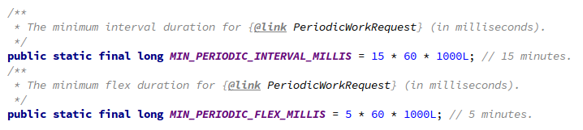
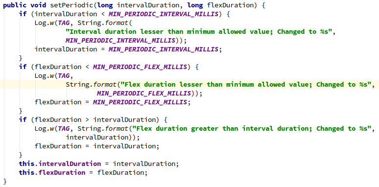
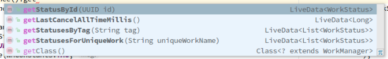
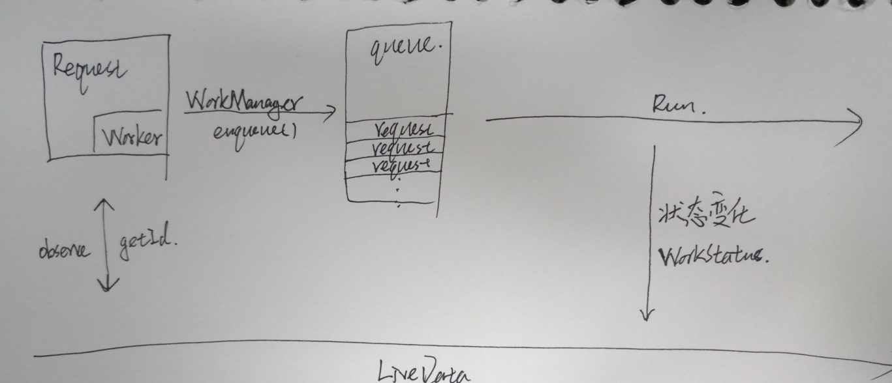

## WorkManager
### 一 WorkManager是用来做什么的？
>WorkManager is intended for tasks that require a guarantee that the system will run them even if the app exits, like uploading app data to a server. It is not intended for in-process background work that can safely be terminated if the app process goes away; for situations like that, we recommend using ThreadPools.

>1 后台异步操作  
>2 即使app退出依然能够运行  


## 二 使用流程   
WorkManager的API设计非常简单，每个小模块之间的分工十分明确。从大的角度来看，WorkMnager的使用需要这几样东西：    
**1 Worker，是一个抽象执行体，需要具体实现，是WorkManager的业务执行模块，所有工作都在doWork方法中执行：**   
```java  
@NonNull
@Override
public Result doWork() {
    // do something
    return null;
}

public enum Result {
        SUCCESS,
        FAILURE,
        RETRY
    }
```  
**2 WorkRequest，是一个数据入口，采用链式调用将执行体Worker需要的数据通过方法setInputData注入进去。WorkManager提供了两种Request，OneTimeWorkRequest(只执行一次的request，比如获取一次后台数据)以及PeriodicWorkRequest(可以设置时间间隔多次执行的request，比如定时向后台发送数据)。实例化Request需要将Worker作为Builder参数，每个request都有一个由UUID随即生成的id，然后将创建好的Request添加到WorkManager的队列中：**  
2.1 OneTimeWorkRequest
```java  
Data data = new Data.Builder().putString("key_request_0", "value_0").putString("key_request_1", "value_1").build();
OneTimeWorkRequest mRequest = new OneTimeWorkRequest.Builder(SampleWorker.class)
    .setInputData(data).build();
WorkManager.getInstance().enqueue(mRequest);
```     
2.2 PeriodicWorkRequest
```java
// 每12小时执行一次，执行时机不确定，可能在间隔的末尾也可能在任何实际成熟的时候。
PeriodicWorkRequest mRequest0 = new PeriodicWorkRequest.Builder(SampleWorker.class
        , 12, TimeUnit.HOURS).build();

// 每12小时执行一次，执行时机不确定，可能在间隔的末尾也可能在任何实际成熟的时候。
if (android.os.Build.VERSION.SDK_INT >= android.os.Build.VERSION_CODES.O) {
    PeriodicWorkRequest mRequest1 = new PeriodicWorkRequest.Builder(SampleWorker.class
            , Duration.ofHours(12)).build();
}

// 没12小时执行一次，但是从repeatInterval-flexInterval开始执行，且flexInterval <= repeatInterval。
PeriodicWorkRequest mRequest2 = new PeriodicWorkRequest.Builder(SampleWorker.class
        , 12, TimeUnit.HOURS
        , 10, TimeUnit.HOURS).build();
```  
并且PeriodicWorkRequest有严格的interval时间限制：
<div align=center></div>

但是如果设置的interval小于限制并不会报异常，而是自动采用最小值：
<div align=center></div>

如果不需要WorkManager的运行结果，写到这里就可以了。  
**3  WorkStatus，结果输出者，包括Worker的完成状态(如下枚举)，对应request的id，tag以及数据(一个Date实例)的输出，WorkStatus作为request的输出需要通过WorkManager的相关方法与LiveData添加监听来获取，当WorkStatus状态变化的时候就会给LiveData回调：**  
3.1 WorkStatus的状态枚举：
```java   
public enum State {
    ENQUEUED,
    RUNNING,
    SUCCEEDED,
    FAILED,
    BLOCKED,
    CANCELLED;
    public boolean isFinished() {
        return (this == SUCCEEDED || this == FAILED || this == CANCELLED);
    }
}
```
3.2  获取WorkStatus主要有四个方法，都要添加LiveData：
<div align=center></div>

3.3 具体代码：
```java   
WorkManager.getInstance().getStatusById(id).observe((LifecycleOwner) mContext, new Observer<WorkStatus>() {
            @Override
            public void onChanged(@Nullable WorkStatus workStatus) {
                switch (workStatus.getState()){
                    case ENQUEUED:{
                        // do something
                    }break;
                    case RUNNING:{
                        // do something
                    }break;
                    case SUCCEEDED:{
                        Data output = workStatus.getOutputData();
                        String requestStr = output.getString(WMConstants.DATA_OUTPUT_KEY_REQUEST, WMConstants.DATA_OUTPUT_DEFAULT_REQUEST);
                        String outputStr = output.getString(WMConstants.DATA_OUTPUT_KEY_CONTENT, WMConstants.DATA_OUTPUT_DEFAULT_VALUE);
                        Log.e(WMConstants.TAG, requestStr + " : "+outputStr);
                    }break;
                    case FAILED:{
                        // do something
                    }break;
                    case BLOCKED:{
                        // do something
                    }break;
                    case CANCELLED:{
                        // do something
                    }break;
                }
            }
        });
```  
那么有一个问题，如果返回结果的时候app已经退出了，但是要进行UI操作怎么办？这已经不是WorkManager可以处理的事情了，实际上这是LiveData的职能范畴。LiveData在返回数据之前会判断绑定时LifecycleOwner的状态，不用说退出，即便是activity/fragment退入后台，也不会返回数据，不用担心造成NPE。这里不费时分析LiveData的原理，有兴趣的同学可以去看看源码，体验一下。
#### 总结
<div align=center></div>

## 三 灵活多变的任务链
Workmanager对于那些依赖前后返回结果的Task添加了一些使用的可以实现顺序执行的任务链的API。   
1 A --> B --> c  
```java
WorkManager.getInstance().beginWith(RequestA).then(RequestB).then(RequestC).enqueue();
```
这里有一个需要注意的地方，任务链的Request的都是OneTimeWorkRequest。为什么？  
2 还可以通过WorkContinuation实现更复杂的任务链   
A --> B     
&#160;&#160;&#160;&#160;&#160;&#160;&#160;&#160;&#160;&#160;&#160;&#160;&#160;&#160;&#160;&#160;-->E  
C --> D    
```java
WorkContinuation chain1 = WorkManager.getInstance()
        .beginWith(RequestA)
        .then(RequestB);
WorkContinuation chain2 = WorkManager.getInstance()
        .beginWith(RequestC)
        .then(RequestD);
WorkContinuation chain3 = WorkContinuation
        .combine(chain1, chain2)
        .then(RequestE);
chain3.enqueue();
```
## 四 唯一任务  
每个创建的Request的ID都是经过UUID的随即获取方法随机获取到的，那么就WorkRequest而言我们基本是无法确定一个任务是否正在执行或者在队列中等待pop，所以为了解决这个问题，WorkManager中添加了方法&#160;**beginUniqueWork** 用来push唯一name的OneTimeWorkRequest：  
```java
public final WorkContinuation beginUniqueWork(
        @NonNull String uniqueWorkName,
        @NonNull ExistingWorkPolicy existingWorkPolicy,
        @NonNull OneTimeWorkRequest... work) {
    return beginUniqueWork(uniqueWorkName, existingWorkPolicy, Arrays.asList(work));
}

public abstract WorkContinuation beginUniqueWork(
        @NonNull String uniqueWorkName,
        @NonNull ExistingWorkPolicy existingWorkPolicy,
        @NonNull List<OneTimeWorkRequest> work);
```  
```java
Data data = new Data.Builder().putString(WMConstants.DATA_INPUT_KEY_REQUEST, "OneTimeWorkRequest").putString(WMConstants.DATA_INPUT_KEY_CONTENT, "enqueue date:"+formatTime(System.currentTimeMillis(), "HH:mm:ss")).build();
OneTimeWorkRequest mRequest = new OneTimeWorkRequest.Builder(SampleWorker.class)
        .setInputData(data).build();
WorkManager.getInstance().beginUniqueWork("unique", ExistingWorkPolicy.REPLACE, mRequest).enqueue();
```

如果发现队列中包含相同name的任务的话会按照ExistingWorkPolicy中的约束条件进行相应的操作。
```java
public enum ExistingWorkPolicy {

    /**
     * If there is existing pending work with the same unique name, cancel and delete it.  Then,
     * insert the newly-specified work.
     */
    // 新任务取代旧任务
    REPLACE,

    /**
     * If there is existing pending work with the same unique name, do nothing.  Otherwise, insert
     * the newly-specified work.
     */
    // 忽略新任务
    KEEP,

    /**
     * If there is existing pending work with the same unique name, append the newly-specified work
     * as a child of all the leaves of that work sequence.  Otherwise, insert the newly-specified
     * work as the start of a new sequence.
     */
    // 如果已经存在相同name的work，就把新任务添加到queue末尾，否则添加在queue的开头
    APPEND
}
```

还有添加唯一PeriodicWorkRequest的方法enqueueUniquePeriodicWork()，和上面的方法基本一样，只是约束枚举不同，不作赘述。  
```java
public enum ExistingPeriodicWorkPolicy {

    /**
     * If there is existing pending work with the same unique name, cancel and delete it.  Then,
     * insert the newly-specified work.
     */
    // 新任务取代旧任务
    REPLACE,

    /**
     * If there is existing pending work with the same unique name, do nothing.  Otherwise, insert
     * the newly-specified work.
     */
    // 忽略新任务
    KEEP
}
```
## 五 深入思考  
***1 与常规的异步(AsyncTask, ThreadPool等)有何不同？***   
&emsp;&emsp;在官方给出的文档中可以看出来，WorkManager的出现并不是为了替代这些传统的异步方式。他们最大的不同，就是这些传统的方式在app退出进程被杀死的情况下是会一起被杀死的，而WorkManager可以重启进程(Application会被重新实例化，分配新的PID)，就像守护进程那样。但是这里也许是WorkManager的逻辑还不完善，在我的demo中，当只入列一个OneTimeWorkRequest的时候，杀死进程，进程有一定概率并不会重启。并且这个request会一直处于ENQUEUE状态。

***2 为什么能够在app杀死之后重新启动？***  
&emsp;&emsp;针对这个问题先研究一下WorkManager的源码。WorkManager是个单例，但是不需要在Application中预先初始化，所以是如何初始化的？
  ```java
  public class WorkManagerInitializer extends ContentProvider {
    @Override
    public boolean onCreate() {
        // Initialize WorkManager with the default configuration.
        WorkManager.initialize(getContext(), new Configuration.Builder().build());
        return true;
    }
    // nothing else
 }
  ```
  WorkManager的初始化是放在自己包内的一个自定义ContentProvider里面的。这样做有什么好处？ContentProvider的onCreate方法的调用时机实际上在Application的attachBaseContext和onCraete之间，因为已经调用了attachBaseContext所以即便是调用getContext也能获得Application的context。这样至少实现了一种“隐式初始化”，其他好处不明......

  ***flag_0:暂时忽略初始化方法中的new Configuration.Builder().build()***

下一个问题，WorkManager中任务queue的执行者是谁？
在每次入列都会调用一个方法---enqueue()，所以从这里开始:
```java
 @Override
 public void enqueue() {
    // Only enqueue if not already enqueued.
    if (!mEnqueued) {
        // The runnable walks the hierarchy of the continuations
        // and marks them enqueued using the markEnqueued() method, parent first.
        mWorkManagerImpl.getTaskExecutor()
                .executeOnBackgroundThread(new EnqueueRunnable(this));
    } else {
        Log.w(TAG, String.format("Already enqueued work ids (%s)", TextUtils.join(", ", mIds)));
    }
}
```
这个方法的最终是调用了EnqueueRunnable的run方法，那么：
```java
 public void run() {
    if (mWorkContinuation.hasCycles()) {
        throw new IllegalStateException(
                String.format("WorkContinuation has cycles (%s)", mWorkContinuation));
    }
    boolean needsScheduling = addToDatabase();
    if (needsScheduling) {
        scheduleWorkInBackground();
    }
}
```
这里有一个特别奇怪的方法，暂时忽略

***flag_1:暂时忽略addToDatabase()***

然后是：
```java
 public void scheduleWorkInBackground() {
    WorkManagerImpl workManager = mWorkContinuation.getWorkManagerImpl();
    Schedulers.schedule(
            workManager.getConfiguration(),
            workManager.getWorkDatabase(),
            workManager.getSchedulers());
}
```
这个方法里面我们需要查看第三个方法(有兴趣的人可以看看前两个方法的源码，很绕，不多说)：
```java
 public @NonNull List<Scheduler getSchedulers>() {
    // Initialized at construction time. So no need to synchronize.
    if (mSchedulers == null) {
        mSchedulers = Arrays.asList(
                Schedulers.createBestAvailableBackgroundScheduler(mContext, this),
                new GreedyScheduler(mContext, this));
    }
    return mSchedulers;
}
```
然后：
```java
 static @NonNull Scheduler createBestAvailableBackgroundScheduler(
        @NonNull Context context,
        @NonNull WorkManagerImpl workManager) {

    Scheduler scheduler;
    boolean enableFirebaseJobService = false;
    boolean enableSystemAlarmService = false;

    if (Build.VERSION.SDK_INT >= WorkManagerImpl.MIN_JOB_SCHEDULER_API_LEVEL) {
        scheduler = new SystemJobScheduler(context, workManager);
        setComponentEnabled(context, SystemJobService.class, true);
        Log.d(TAG, "Created SystemJobScheduler and enabled SystemJobService");
    } else {
        try {
            scheduler = tryCreateFirebaseJobScheduler(context);
            enableFirebaseJobService = true;
            Log.d(TAG, "Created FirebaseJobScheduler");
        } catch (Exception e) {
            // Also catches the exception thrown if Play Services was not found on the device.
            scheduler = new SystemAlarmScheduler(context);
            enableSystemAlarmService = true;
            Log.d(TAG, "Created SystemAlarmScheduler");
        }
    }

    try {
        Class firebaseJobServiceClass = Class.forName(FIREBASE_JOB_SERVICE_CLASSNAME);
        setComponentEnabled(context, firebaseJobServiceClass, enableFirebaseJobService);
    } catch (ClassNotFoundException e) {
        // Do nothing.
    }

    setComponentEnabled(context, SystemAlarmService.class, enableSystemAlarmService);

    return scheduler;
}

public static final int MIN_JOB_SCHEDULER_API_LEVEL = 23;
```
终于来到了最关键的部分 --- 根据系统版本以及服务选取最恰当的调度器。
基本规则是这样的API大于23(6.0)，将选用系统的SystemJobScheduler作为底层的调度器，小于23将会优先选择FirebaseJobScheduler作为调度器，如果不存在将会使用系统的SystemAlarmScheduler(类注释：A Scheduler that schedules work using android.app.AlarmManager)
现在只研究第一种情况(我的测试机是这种情况......)
SystemJobScheduler是什么？是个调度器，用来调度任务的，并不是一个线程，也不产生线程，所以，到底是谁在执行任务？
***回到flag_0  ***
```java
new Configuration.Builder().build()
```
向下一层层深入：
```java
private Configuration(@NonNull Configuration.Builder builder) {
    if (builder.mExecutor == null) {
        mExecutor = createDefaultExecutor();
    } else {
        mExecutor = builder.mExecutor;
    }
    // .........................
}
```
createDefaultExecutor()方法用来创建一个executor，executor是啥？***执行者***
```java
private Executor createDefaultExecutor() {
    return Executors.newFixedThreadPool(
            // This value is the same as the core pool size for AsyncTask#THREAD_POOL_EXECUTOR.
            Math.max(2, Math.min(Runtime.getRuntime().availableProcessors() - 1, 4)));
}
```
***原来WorkManager的最底层的执行者，就是一个ThreadPool，核心数和AsyncTask一样***
那么到目前为止可以笼统的得出一个结论：

**在6.0以上，WorkManager ≈ ThreadPool + SystemJobScheduler + 某种重启机制**

那么WorkManager到底是如何重启进程的？
连续看了五个晚上源码的我也许是方向错了也许是不够细心，并没有找到具体机制,只有一些大概的线索......


***3 WorkManager在进程杀死后重启进程依然能够执行添加进queue中的任务，难道进程杀死时内存数据没有清空？***
即便内存没有清空(不合理)，新的进程(不同的PID)也不能享受同一块内存，所以只有一种可能，保存到本地了。
所以想到了什么？***flag_1***
每次将任务入队都会调用一个方法
```java
addToDatabase()
```
那么是怎样做到的呢(层级太深只给出具体代码):
```java
workDatabase.workSpecDao().insertWorkSpec(workSpec);
```
每个WorkRequest都有一个方法用来获取一个和数据库(Room)相对应的实例的方法getWorkSpec()，获取一个WorkSpec对象：
```java
public class WorkSpec {
    private static final String TAG = "WorkSpec";
    public static final long SCHEDULE_NOT_REQUESTED_YET = -1;

    @ColumnInfo(name = "id")
    @PrimaryKey
    @NonNull
    public String id;

    @ColumnInfo(name = "state")
    @NonNull
    public State state = ENQUEUED;

    @ColumnInfo(name = "worker_class_name")
    @NonNull
    public String workerClassName;

    @ColumnInfo(name = "input_merger_class_name")
    public String inputMergerClassName;

    @ColumnInfo(name = "input")
    @NonNull
    public Data input = Data.EMPTY;

    @ColumnInfo(name = "output")
    @NonNull
    public Data output = Data.EMPTY;

    @ColumnInfo(name = "initial_delay")
    public long initialDelay;

    @ColumnInfo(name = "interval_duration")
    public long intervalDuration;

    @ColumnInfo(name = "flex_duration")
    public long flexDuration;

    // ............................
 }
```
这是Room的数据库表对应的model，Room使用丰富且功能全面的注解来创建数据库。可以看到一边几乎包含所有的信息。
需要注意的是什么？input和output，这说明什么？说明**WorkManger不仅可以保存输入还可以保存输出，所以即便是在app杀死后，过一段时间重新进入app，你也可以通过request的id或者tag找到返回的结果甚至相对应的输入数据**。

那么下一个问题，数据库会一致保存下去吗？
肯定不会。每次创建WorkDataBase都会在create方法中调用回调generateCleanupCallback()，然后执行：
```java
private static String getPruneSQL() {
    return PRUNE_SQL_FORMAT_PREFIX + getPruneDate() + PRUNE_SQL_FORMAT_SUFFIX;
}

static long getPruneDate() {
    return System.currentTimeMillis() - PRUNE_THRESHOLD_MILLIS;
}

private static final long PRUNE_THRESHOLD_MILLIS = TimeUnit.DAYS.toMillis(7);
// Delete rows in the workspec table that...
private static final String PRUNE_SQL_FORMAT_PREFIX = "DELETE FROM workspec WHERE "
        // are completed...
        + "state IN " + COMPLETED_STATES + " AND "
        // and the minimum retention time has expired...
        + "(period_start_time + minimum_retention_duration) < ";

String COMPLETED_STATES = "(" + SUCCEEDED + ", " + FAILED + ", " + CANCELLED + ")";

// and all dependents are completed.
private static final String PRUNE_SQL_FORMAT_SUFFIX = " AND "
        + "(SELECT COUNT(*)=0 FROM dependency WHERE "
        + "    prerequisite_id=id AND "
        + "    work_spec_id NOT IN "
        + "        (SELECT id FROM workspec WHERE state IN " + COMPLETED_STATES + "))";
```
大概意思就是每次初始化数据库都会删除7天之外的状态是SUCCEEDED，FAILED，CANCELLED的任务，后边还有一条，由于还没仔细研究相关的数据库，没看懂......
到目前为止又可以笼统的得出一个结论

**在6.0以上，WorkManager ≈ ThreadPool + SystemJobScheduler + Room + 某种重启机制 **

## 六 吐槽以及还没有搞清楚的疑问    
**吐槽**  
这个异常有点粗心
```java
public static final int MAX_DATA_BYTES = 10 * 1024;    // 10KB

if (outputStream.size() > MAX_DATA_BYTES) {
    throw new IllegalStateException(
            "Data cannot occupy more than " + MAX_DATA_BYTES + "KB when serialized");
}
```


**问题**  
1 WorkManager到底是如何重启进程的？  
2 我的demo日志显示，入队的任务在进程重启之后的执行顺序并不确定，是随机的，为什么？  
3 在我的demo中，当队列只有一个任务的时候，WorkManager有很大概率是不会在app杀死之后重启的，就算重启也经常不会自动执行任务，并且会出现这条任务永远处于ENQUEUE的状态，这是为什么？  
4 WorkContinuationImpl的then方法在创建实例的时候是默认吧自己的name传进去的，那么就有一个问题，如果之前调用了beginUniqueWork这样的方法赋予了一个unique的name，然后调用then方法组成一个任务链，那么任务链里的request会受到ExistingWorkPolicy的约束条件的影响吗？
```java
public WorkContinuation then(List<OneTimeWorkRequest> work) {
    // TODO (rahulrav@) We need to decide if we want to allow chaining of continuations after
    // an initial call to enqueue()
    return new WorkContinuationImpl(mWorkManagerImpl,
            mName,
            ExistingWorkPolicy.KEEP,
            work,
            Collections.singletonList(this));
}
```
