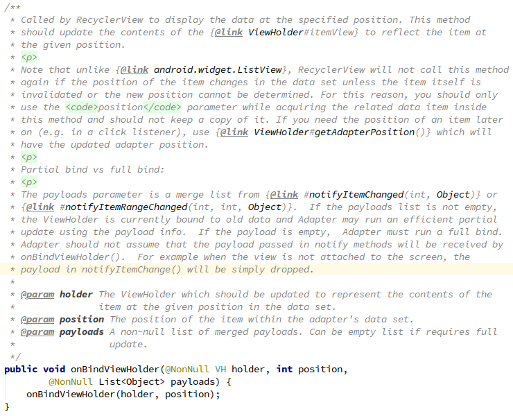
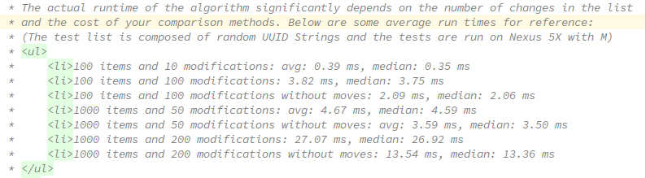

#### DiffUtil  

    DiffUtil是RecyclerView库下的一个使用频率较高的用来实现增量更新的工具。
    这里增量更新的概念容易产生误解。
    这里的增量更新指的是，向列表中插入那些存在于新数据源而不存在于旧数据源的数据，但是那些存在于旧数据源而不存在与新数据源的数据(item)将会被remove掉。
    所以，DiffUtil的增量更新实现的不是那种可以叠加的增量更新，而是会用新数据覆盖旧数据，只不过只会更新那些只存在于新数据源的数据。

##### 1 使用  
###### 1.1 基本的使用方法
&emsp;&emsp;DiffUtil的基本使用非常简单。只需要实现一个Callback就可以了：
- DiffCallback.java

```java
public class DiffCallback extends DiffUtil.Callback {

    private List<GankBean> mOldData, mNewData;

    public DiffCallback(@NonNull List<GankBean> oldData, @NonNull List<GankBean> newData) {
        mNewData = newData;
        mOldData = oldData;
    }

    @Override
    public int getOldListSize() {
        return mOldData == null ? 0 : mOldData.size();
    }

    @Override
    public int getNewListSize() {
        return mNewData == null ? 0 : mNewData.size();
    }

    @Override
    public boolean areItemsTheSame(int i, int i1) {
        return TextUtils.equals(mOldData.get(i)._id, mNewData.get(i1)._id);
    }

    @Override
    public boolean areContentsTheSame(int i, int i1) {
        return mOldData.get(i).isEqualsTo(mNewData.get(i1));
    }

    // 这里算是一个DiffUtil的隐藏彩蛋，下面会写到
    @Nullable
    @Override
    public Object getChangePayload(int oldItemPosition, int newItemPosition) {
        return super.getChangePayload(oldItemPosition, newItemPosition);
    }
}
```

&emsp;&emsp;然后在获取到新数据后这样处理：

```java
private void fetchData() {
        DataRepository.fetchDataFromRemote(new RandomDataOp(), new RepositoryAction() {
            @Override
            public void onAction(ResponseModel model) {
                if (model instanceof LoadingModel) {
                    mPbLoading.setVisibility(View.VISIBLE);
                } else if (model instanceof ErrModel) {
                    mPbLoading.setVisibility(View.GONE);
                } else {
                    mPbLoading.setVisibility(View.GONE);

                    // 这里是最重要的
                    // ****************************************************************
                    ArrayList<GankBean> newData = ((RandomResponseBody) model.resultBody).results;
                    ArrayList<GankBean> oldData = (ArrayList<GankBean>) mAdapter.getOriginalData().clone();

                    // calculateDiff方法用来对比新旧数据，并获得一个result，包含哪些item需要remove，那些item需要insert
                    DiffUtil.DiffResult diffResult = DiffUtil.calculateDiff(new DiffCallback(oldData, newData), true);

                    // 将新数据fill到adapter中替换旧数据，是替换旧数据而不是添加到就数据后边(这里有个疑问下边会讲)。
                    mAdapter.fillData(newData);

                    // 根据diffResult分发更新事件，该insert的insert，该remove的remove。
                    diffResult.dispatchUpdatesTo(mAdapter);
                    // *****************************************************************
                }
            }
        });
    }
```  
> [FLAG_0: 获取adapter中的原始数据的时候，clone()方法是很重要的一个细节，仔细想想为什么？](#flag_0)

&emsp;&emsp;这样就可以简单的使用DiffUtil来实现一个增量更新的case。  

> 上面有个疑问，为什么要用新数据替换旧数据，而不是追加到旧数据后边(或者某个位置)?
> ```java
> public void fillData(List<GankBean> data) {
>          if (data == null || data.size() == 0)
>              return;
>
>          if (mData == null)
>              mData = new ArrayList<>();
>
>          mData.clear();// 这里注释掉会有什么区别？
>          mData.addAll(data);
>      }
> ```
>
> &emsp;&emsp;DiffUtil的原理可以这样简单的描述：先删除UI flow中那些不存在于新数据的item，然后按照顺序，取得需要插入的元数据的postion，然后根据这些position取得元数据，然后插入到它的目标位置。
> &emsp;&emsp;如果用新数据替换旧数据，那么简单的流程就是下面图的样子：  
> <div align=center></div>   
> &emsp;&emsp;如果是将新数据追加到旧数据末尾(举个例子，任何位置都可以)，那么简单的流程就是下面图的样子：  
>
> <div align=center></div>   
> &emsp;&emsp;更新的流程依然会按照diffResult得出的结果进行，但是由于新数据追加到了旧数据的末尾，所以，在按照diffResult的结果通过position获取元数据的时候，获取到的不是新数据的指定位置数据，而是旧数据的相应位置的数据，然后插入到指定位置，就会出现图中的结果。
>
> &emsp;&emsp;**可见如果不是替换旧数据的话，就会出现很大的问题，UI flow显示不正确，adapter的数据与UI flow也不一致。**   

###### 1.2 深入拓展   
&emsp;&emsp;如果有这样的一个场景，在获取到的新数据中某个元数据的唯一标志符和旧数据的某个元数据是一样的，但是内容上有一些差别，按照上面介绍的方法，UI flow上代表这个元数据的item将会被remove掉然后插入新的元数据代表的item，在视觉上会有一个插入动画。但是我不希望这个item重新加载，我希望它可以直接更新有差异的部分，而不是remove掉再insert。这时候要怎么做？
这里就要说到上面提到的隐藏彩蛋getChangePayload。下面是源码的官方注释：

<div align=center></div>

&emsp;&emsp;当areItemsTheSame返回true，而areContentsTheSame返回false的时候就会调用这个方法，这个方法是用来返回两个唯一标识(举个例子)相同但是内容有些许差异的item的差异变量的。从而实现一种针对单个item的内容的增量更新(之前的增量更新针对的是整个item的数据集合)。这个方法需要和adapter的onBindViewHolder(ViewHolder, int, List\<Object\>)方法配合，其中第三个参数就是getChangePayload返回的差量数据([FLAG_1：这里有一个疑问](#flag_1))。下图是这个方法源码部分的注释：
<div align=center></div>
&emsp;&emsp;注释的前半段可以适当忽略，后半段有这样几个重要信息：1 部分绑定(我管它叫差量更新) VS 完全绑定。2 payload集合来自于二参notifyItemChanged或者二参notifyItemRangeChanged。3 payload不为空，就可以实行部分绑定(差量更新)，为空的话就要进行一次完全更新。4 适配器不一定会在三参onBindViewHolder中接收到payload的集合，为啥？没有attach的item的payload会被忽略(drop，扔掉，抛弃，啥啥啥)。

&emsp;&emsp;以下是示例：
- DiffCallback.java  
```java
    @Nullable
    @Override
    public Object getChangePayload(int oldItemPosition, int newItemPosition) {

        Bundle payload = null;
        GankBean oldBean = mOldData.get(oldItemPosition);
        GankBean newBean = mNewData.get(newItemPosition);

        if (!TextUtils.equals(oldBean.desc, newBean.desc)) {
            if (payload == null)
                payload  = new Bundle();
            payload.putString("desc", newBean.desc);
        }
        if (!TextUtils.equals(oldBean.type, newBean.type)) {
            if (payload == null)
                payload  = new Bundle();
            payload.putString("type", newBean.type);
        }

        // 这里是出于什么目的？
        if (!TextUtils.equals(oldBean.createAt, newBean.createAt)
                || !TextUtils.equals(oldBean.publishedAt, newBean.publishedAt)
                || !TextUtils.equals(oldBean.source, newBean.source)
                || !TextUtils.equals(oldBean.url, newBean.url)
                || !TextUtils.equals(oldBean.who, newBean.who)
                || !TextUtils.equals(oldBean.used, newBean.used))
            if (payload == null)
                payload  = new Bundle();

        return payload;
    }
```  
> [FLAG_2: 注释标注的部分是出于什么目的？](#flag_2)
- RandomDiffAdapter.java
```java
@Override
    public void onBindViewHolder(@NonNull ViewHolder holder, int position, @NonNull List<Object> payloads) {
        Log.e("--> RandomAdapter <--", "onBindViewHolder_payload"+" position:"+position);
        Bundle payload = null;
        if (payloads != null && payloads.size() > 0)
            payload = (Bundle) payloads.get(0);

        if (payload == null)
            super.onBindViewHolder(holder, position, payloads);
        else {
            if (holder != null) {
                String type = payload.getString("type");
                if (!TextUtils.isEmpty(type))
                    holder.tvTitle.setText(type);

                String desc = payload.getString("desc");
                if (!TextUtils.isEmpty(desc))
                    holder.tvDesc.setText(desc);
            }
        }
    }
```  
&emsp;&emsp;当没有差量数据传入的时候就不进行差量刷新，而是将方法传入onBindViewHolder(ViewHolder, int)中，执行其他的操作(一般是整体刷新item的UI)；如果有差量数据返回，直接根据返回的数据差量更新指定的控件，精准而简洁，那些不需要改动的UI根本不会刷新。

> 细节：
> - <a name="flag_0"></a>从adapter中获取原始数据时，注意使用clone方法。Callback中是需要传入旧数据和新数据来进行校验的，但是如果使用了getChangePayload方法来获取item数据之间的差量数据，就要注意整个流程上的调用顺序。getChangePayload是在向adapter注入数据之后执行的，那么如果从adapter获取数据的时候如果不用clone方法或者其他的什么方法，就会出现这样一种情况，向adapter中注入数据之后，在执行到getChangePayload方法的时候，会发现，这个方法中的新数据和旧数据是一样的，那么在比对的时候就获取不到差量，那么这个方法的意义就不存在了。
> - <a name="flag_2"></a>有这样的一种情况，item的UI并不需要将所有数据都展示出来，只需要展示一部分，如果getChangePayload方法只对需要展示的数据进行了差异化保存，而没有处理不需要展示的那一部分数据，在需要展示的数据相同但是其他数据不相同的情况下，getChangePayload方法就会返回null，这就意味着adapter将直接通过onBindViewHolder(ViewHolder, int, List\<Object\>)方法，进入到onBindViewHolder(ViewHolder, int)方法，而进入到后者就意味着这个item将会重新刷新一遍，不管UI是否有改动。但是在前面提到的情况下UI是不需要更新的，更新就会造成资源浪费。
> 当然这里也可以这样写，不管两个item的数据是否存在差量，我们都返回一个new之后的bundle，只不过有的bundle是空的，有的携带了数据，在onBindViewHolder(ViewHolder, int, List\<Object\>)中，判断bundle是否携带了数据，如果没有数据再转入onBindViewHolder(ViewHolder, int)，如果有数据直接在这个方法中消化掉任务，这样也是非常不错的。

###### 1.3 在子线程中进行新旧数据集合对比
&emsp;&emsp;在Callback源码开头的注释中写着，DiifUtil采用的是Eugene W. Myers's difference算法来计算最小更新数量的，但是这个算法对那些被移动的item无法处理，所以Google对这个算法进行了一定的改进，但是随之而来的就是性能上打折扣。下图是注释中给出的测试数据：
<div align=center></div>

&emsp;&emsp;可见在主线程中进行大数据量的计算是很耗费时间的，会长时间的阻塞主线程，所以可以放到子线程中去计算。很简单，只需要将DiffUtil.calculateDiff这个方法的执行部分放到一个子线程中，然后将结果传递给主线程即可(Handler等)，不多于赘述。
> DiffUtil存在一定的局限性，由于自身的实现原理，大数据量下性能堪忧，需要放到子线程中计算，使用步骤又显得很"诡异"，封装不佳，容易忽略步骤，所以RecyclerView lib中提供了另外一个工具---AsyncListDiffer，来替代DiffUtil。

###### <a name="flag_1">1.4 一些疑问</a>

- 如果两个item的唯一标识相同但是具体内容有差别，那么UI上是怎么更新的，在DiffResult中是一个什么样的状态？  
- 方法getChangePayload的返回值是一个Object，但是与之配合使用的onBindViewHolder方法中，是一个List\<Object\>，这是什么目的？


##### 2 源码及原理(RecyclerView lib的源码分析有优先级不高，熟练掌握使用既可以了，留待时间充裕时分析)
